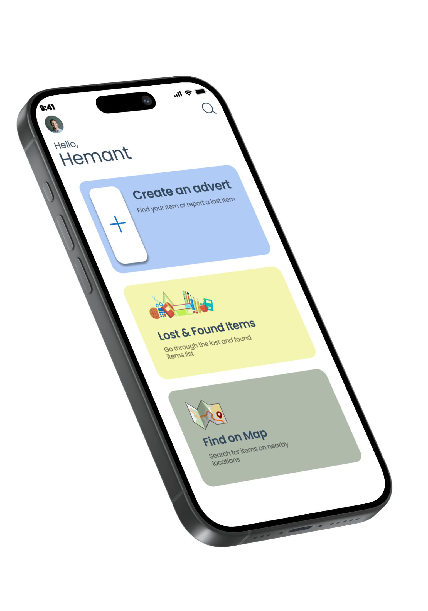
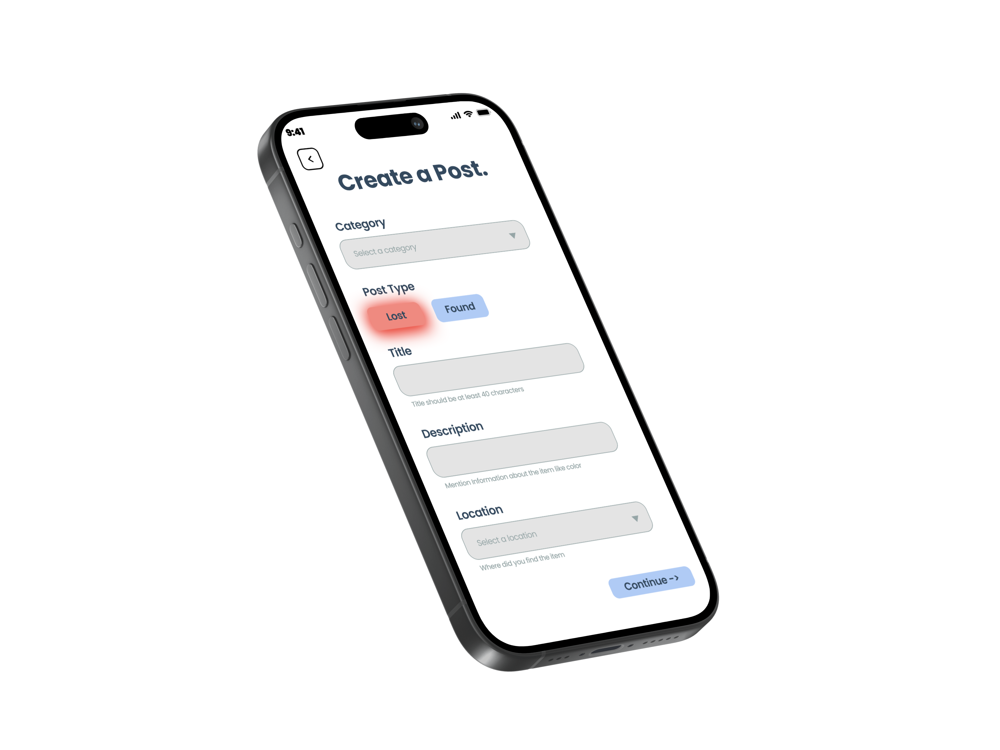

# Reclaimify - Lost and Found App

Welcome to Reclaimify, a Flutter-based Lost and Found app designed to streamline the process of returning lost items to their rightful owners. This repository contains the source code and essential information for developers looking to explore or contribute to the project.

[Download App here](https://drive.google.com/drive/folders/16SK5NhYPBm7Tv1K5_yofevvj2pe8aBfg?usp=drive_link)

## UI Demonstration

 

 

## Features

- **Search and Match:**
  - Effortlessly search for lost items using intuitive keywords and filters.
  - Powerful matching algorithms ensure accurate and efficient item retrieval.

- **Secure and Private:**
  - Prioritize user privacy with robust security measures.
  - All communications and personal information are encrypted for a secure experience.

- **Customized Item Reporting:**
  - Tailor your lost item reports with specific details to enhance accuracy.

- **Messaging:**
  - Whatsapp Integration to message the advert owner

## Technologies Used

- **Flutter Framework:**
  - Developed using the Flutter framework for a cross-platform and seamless user experience.
  - Ensures consistency in app design and functionality across iOS and Android platforms.

- **Firebase Integration:**
  - Integrated Firebase for secure and scalable backend services.
  - Utilized Firebase Authentication for user authentication and Firestore for real-time data storage.

- **Custom Search Algorithms:**
  - Implemented custom search algorithms to enhance the search and matching functionality.
  - Ensured accurate and speedy retrieval of lost items based on user input and criteria.

## Getting Started

1. **Clone the Repository:**
   ```bash
   git clone https://github.com/yaksh1/reclaimify.git
   ```

2. **Navigate to the Project Directory:**
   ```bash
   cd reclaimify
   ```

3. **Install Dependencies:**
   ```bash
   flutter pub get
   ```

4. **Run the App:**
   ```bash
   flutter run
   ```

For more detailed information and development guidelines, please refer to the [Documentation](./docs).

## License

This project is licensed under the [MIT License](./LICENSE).

---

Thank you for exploring Reclaimify! If you have any questions or feedback, feel free to [reach out](mailto:yakshgandhi1@email.com). Happy coding! 🚀
